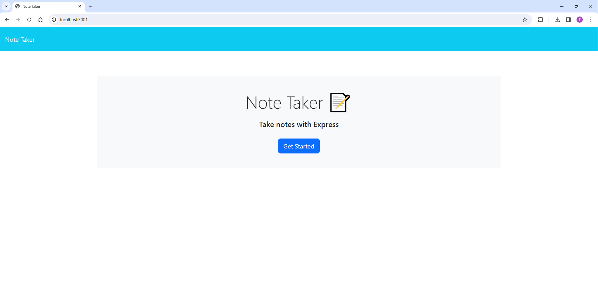
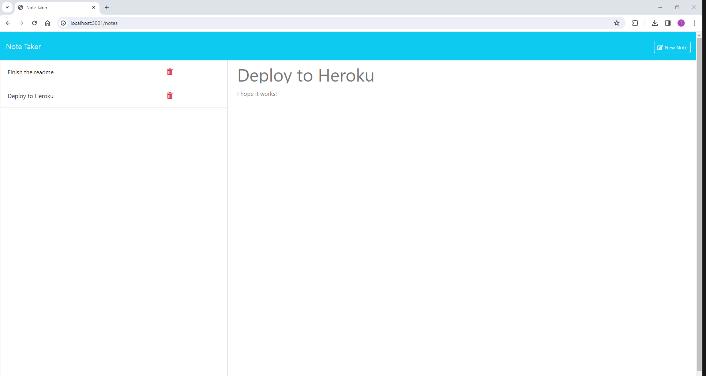

# Note Taker - Express.js

## Description

This application is designed to allow the user to take and delete notes. It uses Express.js backend and saving and retrieving data is done by using a JSON file.

## Table of Contents
* [Screenshots](#screenshots)
* [Installation](#installation)
* [Usage](#usage)
* [Contributing](#contributing)
* [Tests](#tests)
* [Questions](#questions)
* [License](#license)

## Screenshots

## Installation

* Clone the repository, or download and extract the zip file:
    >[git@github.com:TP4458/Note-Taker-Express.js-Tomasz-Pawlikowski.git](git@github.com:TP4458/Note-Taker-Express.js-Tomasz-Pawlikowski.git)  
    >  
    >[https://github.com/TP4458/Note-Taker-Express.js-Tomasz-Pawlikowski/archive/refs/heads/main.zip](https://github.com/TP4458/Note-Taker-Express.js-Tomasz-Pawlikowski/archive/refs/heads/main.zip)
* Navigate to the folder containing the files using your CLI.
* Run npm install.
* Run node index.js.

## Usage

Once the application has been installed and started, it will run on localhost:3001 server.

## Contributing

To contribule to this project you can contact me using the links found in [Questions](#questions) section.

## Tests

N/A

## Questions
Any questions regarding this project can be directed to:
* Email: [TP4458@gmail.com](TP4458@gmail.com)
* GitHub [TP4458](https://github.com/TP4458)

## License
This product is licensed with MIT License. Please click on the badge below, or at the top of this document to find out more.

 
